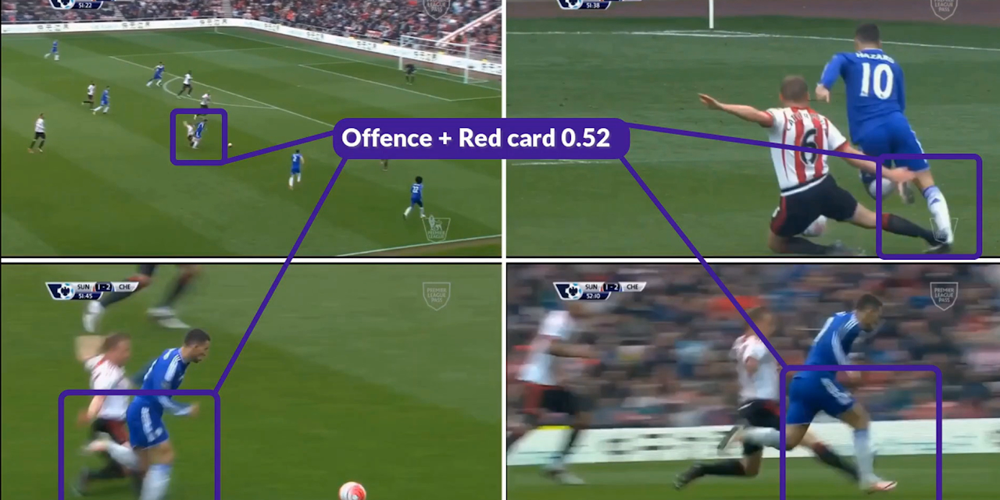

# Temat projektu
ZZSN 24L KD - temat nr 5
Wielozadaniowe rozpoznawanie faulów przy użyciu modelu wykorzystującego wiele widoków

## Członkowie zespołu

- Adam Górski, 304054
- Miłosz Łopatto, 305898

## Opis zadania
Zadanie jest częścią konkursu łączącego piłkę nożną i wizję komputerową [Soccernet: Multi-View Foul Recognition 2024](https://www.soccer-net.org/tasks/new-multi-view-foul-recognition).



Problem dotyczy wieloetykietowej klasyfikacji przewinień z meczów piłki nożnej. Dla każdej akcji widzianej z wielu perspektyw należy przypisać dwie etykiety:

- pierwsza etykieta określa, czy wystąpił faul wraz z odpowiadającym mu stopniem powagi:
    - *No Offence*
    - *Offence + No Card*
    - *Offence + Yellow Card*
    - *Offence + Red Card*
- druga etykieta identyfikuje typ akcji:
    - *Standing Tackle*
    - *Tackle*
    - *Holding*
    - *Pushing*
    - *Challenge*
    - *Dive/Simulation*
    - *High Leg*
    - *Elbowing*

## Ustalony cel
W trakcie omawiania koncepcji projektu ustalone zostało, że celem jest pobicie baseline'u.

# Opis architektury modelu


### Pierwsza część architektury - enkoder
Pierwszą częścią architektury jest model wyciągający cechy z klipów wideo. Domyślnie wykorzystywane są wcześniej wytrenowane modele wideo z biblioteki torchvision - takie jak r3d_18, s3d, mc3_18, r2plus1d_18 i mvit_v2_s.

### Druga część architektury - agregator
Kolejną warstwą architektury jest agregator, który łączy ze sobą wyniki z kilku wcześniej wspomnianych enkoderów.

### Trzecia część architektury - głowica do klasyfikacji wielozadaniowej
Ostatnia część architektury zwraca prawdopodobieństwa poszczególnych klas dla każdego z zadań.


# Przeprowadzone eksperymenty

### Wykorzystane technologie
Rozwiązanie zostałe zaimplementowane przy użyciu języka Python 3.10 z użyciem bibliotek PyTorch oraz PyTorch Lightning. Ta biblioteka pozwoliła nam na znaczne oczyszczenie kodu oraz jego strukturyzację z użyciem metod programowania obiektowego. Dodatkowo PyTorch Lightning dobrze integruje się ze Slurm-em oraz Weights and Biases, które wykorzystaliśmy do śledzenia eksperymentów.

### Przetwarzanie danych

#### Liczba klatek na sekundę:
Zaczęliśmy eksperymentowanie z liczbą klatek na sekundę (fps) oraz klatką startową i klatką końcową. Środek nagrań utrzymaliśmy na 75 klatce, ponieważ wtedy przeważnie występuje foul. Eksperymentowaliśmy natomiast z szerokością okna. Zmiana liczby klatek na sekundę wymusza zmianę szerokości okna. Przykładowo:

- dla 12 klatek na sekundę `start_frame` powinno zostać ustawione na 58, a `end_frame` na 92. Wtedy model przeanalizuje co drugą klatkę (nagrania są w 24 klatkach na sekundę) i środek będzie się znajdował w 75 klatce,
- dla 24 klatek na sekundę `start_frame` powinno zostać ustawione na 63, a `end_frame` na 87. Wtedy model przeanalizuje każdą klatkę, ale okno będzie "węższe", czyli model ma szansę zobaczyć więcej szczegółów na krótszym fragmencie wideo.

Domyślnie `fps` było ustawiona na 17. My jednak zostawiliśmy go na 12, ponieważ dawało nam to najlepsze wyniki.

#### Augmentacja danych:
Dodatkowo eksperymentowaliśmy także z augmentacją danych. Uzyskiwane przez nas wyniki polepszyło dodanie technik `RandomResizedCrop` oraz `GaussianBlur`. Ostatecznie wyglądało to następująco:
```python
transformAug = transforms.Compose([
    transforms.RandomResizedCrop(size=(224, 224), scale=(0.8, 1.0)),
    transforms.RandomAffine(degrees=(0, 0), translate=(0.2, 0.2), scale=(0.8, 1.2)),
    transforms.RandomPerspective(distortion_scale=0.5, p=0.5),
    transforms.RandomRotation(degrees=10),
    transforms.ColorJitter(brightness=0.6, saturation=0.6, contrast=0.6),
    transforms.RandomHorizontalFlip(),
    transforms.GaussianBlur(kernel_size=(5, 9), sigma=(0.1, 5)),
])
```

### Eksperymenty w ramach enkodera

- [x] wykorzystanie innych modeli z biblioteki torchvision
- [x] wykorzystanie enkoderów opartych na transformerach

Ostatecznie najlepszym enkoderem okazał się oparty na transformerze MviTv2. Działał on zdecydowanie lepiej od pozostałych opcji, szczególnie tych opartych na konwolucji.

Prawdopodobnie jedyne co mogło zadziałać lepiej od MviTv2 to Swin3D, który w niektórych benchmarkach dawał niewiele lepsze wyniki. Swin3D także jest oparty na transformerach, lecz powodował problemy z brakiem pamięci.

![Porównanie wyników uzyskiwanych w benchmarkach przez MviTv2 i Swin3D [5].](../../figures/encoders_comparison.png)

Eksperymentowaliśmy również z ViViT (Video Vision Transformer) z niestandardową głowicą klasyfikacyjną, ale nie udało nam się uzyskać wyników lepszych niż bazowe.

### Trenowanie i podział danych
Używaliśmy obiektu PyTorch Learning Trainer, aby znacznie ułatwić zarządzanie treningiem. Podział danych wyglądał następująco:

- 2915 akcji w zbiorze treningowym
- 410 akcji w zbiorze walidacyjnym
- 300 akcji w zbiorze testowym
- 272 akcje w zbiorze challange

Wykorzystywaliśmy również różne callbacki, takie jak zapisywanie modelu na krok i wczesne zatrzymanie.

Do uzyskania dobrych wyników niezbędne było także wykorzystanie ważonej funkcji straty.


### Hyperparametry dla najlepszego modelu
```json
{
    "pre_model": "mvit_v2_s",
    "pooling_type": "attention",
    "num_views": 5,
    "fps": 12,
    "start_frame": 58,
    "end_frame": 92,
    "batch_size": 2,
    "max_num_worker": 4,
    "LR": 0.00005,
    "gamma": 0.3,
    "step_size": 3,
    "weight_decay": 0.001,
    "data_aug": true,
    "weighted_loss": true
}
```

### Logi dla najlepszego modelu: `legendary-dream-270`


# Wyniki eksperymentów
Ostatecznie na zbiorze testowym nasz zespół zdobył trzecie miejsce ze zbalansowaną klasowo celnością dla powagi przewinienia wynoszącą 39.84, zbalansowana celnością dla akcji wynoszącą 45.94 i połączoną metryką 43.68. Dla porównania model bazowy (baseline) miał dla powagi przewinienia 36.25, dla akcji 54.18 i połączoną metrykę 39.60.


Nasz zespół nazywał się `PW ZZSN`. Chociaż nie udało się uzyskać najlepszego wyniku, to udało się pobić baseline, a na zbiorze testowym niewiele brakowało nam do drugiego miejsca.


# Wnioski
Ze względu na podobieństwo zadań stosowanie do obu jednego modelu znacznie ułatwiło trening oraz poprawiło odporność modelu. Augmentacja też pozwoliła nam lepiej przewidywać próbki ze zbioru ukrytego - często próbki w zbiorze ukrytym reprezentowały bardzo zbliżone klipy, ale przykładowo z kamery z innym naświetleniem lub pod innym kątem. Dodatkowo ze względu na bardzo dużą liczbę zdjęć (klip wideo) ważne jest odpowiednie próbkowanie oraz to, żeby dane testowe na których wykonywana jest inferencja były próbkowane w ten sam sposób co treningowe. Przy długim ciągu danych bardzo efektywną strategią jest także połączenie wyciągania cech danym modelem oraz mechanizm atencji pomiędzy nimi i dopiero do wyjścia dołączona głowica lub głowice atencji. Ze względu na przesadne dopasowanie przydatne też okazały się nam mechanizmy regularyzacji takie jak weight_decay.

# Dalsze możliwości rozwoju
Ciekawym pomysłem byłoby przetestowanie architektury Hiera [4].

### Bibliografia
1. [Held, J., Cioppa, A., Giancola, S., Hamdi, A., Ghanem, B., & Van Droogenbroeck, M. (2023). VARS: Video Assistant Referee System for Automated Soccer Decision Making from Multiple Views.](https://arxiv.org/abs/2304.04617)
2. [Arnab, A., Dehghani, M., Heigold, G., Sun, C., Lučić, M., & Schmid, C. (2021). ViViT: A Video Vision Transformer.](https://arxiv.org/abs/2103.15691)
3. [Yanghao Li, Chao-Yuan Wu, Haoqi Fan, Karttikeya Mangalam, Bo Xiong, Jitendra Malik, Christoph Feichtenhofer (2021) MViTv2: Improved Multiscale Vision Transformers for Classification and Detection.](https://arxiv.org/abs/2112.01526)
4. [Chaitanya Ryali, Yuan-Ting Hu, Daniel Bolya, Chen Wei, Haoqi Fan, Po-Yao Huang, Vaibhav Aggarwal, Arkabandhu Chowdhury, Omid Poursaeed, Judy Hoffman, Jitendra Malik, Yanghao Li, Christoph Feichtenhofer. 2023. Hiera: A Hierarchical Vision Transformer without the Bells-and-Whistles.](https://arxiv.org/abs/2306.00989)
5. [Pytorch vision models](https://pytorch.org/vision/main/models.html)
