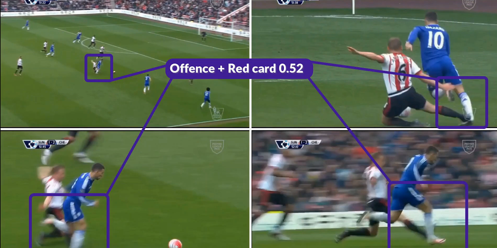
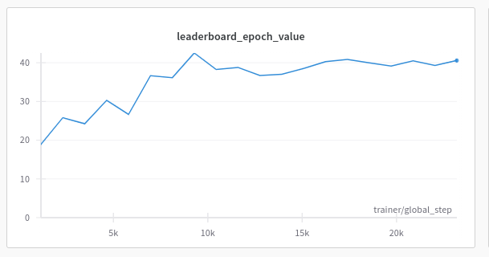
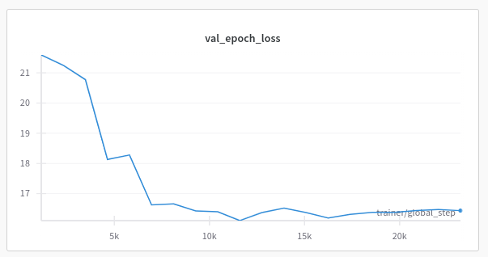

# Temat projektu
ZZSN 24L KD - temat nr 5
Wielozadaniowe rozpoznawanie faulów przy użyciu modelu wykorzystującego wiele widoków
# Członkowie zespołu
- Adam Górski, 304054
- Miłosz Łopatto, 305898
# Opis zadania
Zadanie jest częścią konkursu łączącego piłkę nożną i wizję komputerową [Soccernet: Multi-View Foul Recognition 2024](https://www.soccer-net.org/tasks/new-multi-view-foul-recognition).


Problem dotyczy wieloetykietowej klasyfikacji przewinień z meczów piłki nożnej. Dla każdej akcji widzianej z wielu perspektyw należy przypisać dwie etykiety:

- pierwsza etykieta określa, czy wystąpił faul wraz z odpowiadającym mu stopniem powagi:
    - *No Offence*
    - *Offence + No Card*
    - *Offence + Yellow Card*
    - *Offence + Red Card*
- druga etykieta identyfikuje typ akcji:
    - *Standing Tackle*
    - *Tackle*
    - *Holding*
    - *Pushing*
    - *Challenge*
    - *Dive/Simulation*
    - *High Leg*
    - *Elbowing*


# Opis architektury modelu

### Pierwsza część architektury - enkoder
Pierwszą częścią architektury jest model wyciągający cechy z klipów wideo. Domyślnie wykorzystywane są wcześniej wytrenowane modele wideo z biblioteki torchvision - takie jak r3d_18, s3d, mc3_18, r2plus1d_18 i mvit_v2_s.

### Druga część architektury - agregator
Kolejną warstwą architektury jest agregator, który łączy ze sobą wyniki z kilku wcześniej wspomnianych enkoderów.

### Trzecia część architektury - głowica do klasyfikacji wielozadaniowej
Ostatnia część architektury zwraca prawdopodobieństwa poszczególnych klas dla każdego z zadań. Tutaj na ten moment nie planujemy wprowadzać większych zmian i będziemy chcieli skupić się na optymalizacji dwóch pierwszych 
części architektury.

# Przeprowadzone eksperymenty

### Wykorzystane technologie
Rozwiązanie zostałe zaimplementowane przy użyciu języka Python 3.11 z użyciem bibliotek PyTorch
oraz PyTorch Lightning. Ta biblioteka pozwoliła nam na znaczne oczyszczenie kodu oraz jego strukturyzację z użyciem 
metod programowanie obiektowego. Dodatkowo PyTorch Lightning dobrze integruje się z Slurm-em oraz Weights and Biases, które wykorzystaliśmy do śledzenia eksperymentów.

### Przetwarzanie danych
Zaczęliśmy eksperymentowanie z liczbą klatek na sekundę (fps) oraz
klatką startową i klatką końcową. Z naszych wyników wyszło, że najlepsze
rezultaty osiągneliśmy trzymając środek nagrania na 75 klatce. Próbowaliśmy
zwiększyć także liczbę klatek na sekundę, ale nie uzyskaliśmy przez to
żadnych lepszych rezultatów. Najlepsze rezultaty okazały się dla klatki
startowej 58-mej i końcowej 92-giej. Dodatkowo eksperymentowaliśmy z technikami augmentacji danych takimi jak Gaussian Blur. Jedyną metodą augmentacji, która rzeczywiście pozwoliła nam poprawić wyniki były usunięcie z orginalnej implementacji losowego usuwania i zatrzymanie
wszystkich pozostałych transformat. Dodatkowo jeśli chodzi o liczbę widoków
to jedyna liczba, która była dla nas optymalna to 5 - jakakolwiek inna prowadziła do zmniejszonej efektywności i model miał problem z nauką.

### Modyfikacja architektury
Pomimo uruchamiania na dużym klastrze z użyciem Slurm, nie udało nam się uruchomić transformera Swin3D, ponieważ doświadczaliśmy problemów z brakiem pamięci. Z tego powodu użyliśmy MViTv2, który dawał wyniki zbliżone do Swin3D. Udało nam się również nieco poprawić nasze wyniki, stosując ważoną funkcję straty. Jedyną metodą agregacji, która przyniosła poprawę wyników, była uwaga (attention). Użycie zarówno średniej, jak i maksimum prowadziło do znacznie gorszych wyników.
Eksperymentowaliśmy również z ViViT (Video Vision Transformer) z niestandardową głowicą klasyfikacyjną, ale nie udało nam się uzyskać wyników lepszych niż bazowe.


### Trenowanie
Używaliśmy obiektu PyTorch Learning Trainer, aby znacznie ułatwić zarządzanie treningiem. W celu treningu podzieliliśmy zbiór danych treningowych na treningowy i walidacyjny, aby zapobiec przeuczeniu, w proporcjach 7:3. Testowaliśmy również różne callbacki, takie jak zapisywanie modelu na krok i wczesne zatrzymanie. Używaliśmy także strategii Distributed Data Parallel do treningu.

### Hyperparametry dla najlepszego modelu
```json
{
"start_frame": 58,
"end_frame": 92,
"fps": 12,
"num_views": 5,
"pre_model": "mvit_v2_s",
"max_num_worker": 4,
"batch_size": 2,
"data_aug": true,
"pooling_type": "attention",
"weight_decay": 0.001,
"step_size": 3,
"gamma": 0.35,
"LR": 5.0e-05,
"weighted_loss": true
}

```
### Wykresy funkcji straty



# Wyniki eksperymentów
Ostatecznie na zbiorze testowym nasz zespół zdobył trzecie miejsce
ze zbalansowaną klasowo celnością dla powagi przewinienia wynoszącą 39.84,
zbalansowana celnością dla akcji wynoszącą 45.94 i połączoną metryką 43.68.
Dla porównania model bazowy (baseline) miał dla powagi przewinienia 36.25,
dla akcji 54.18 i połączoną metrykę 39.60.

Nasz zespół nazywał się PW ZZSN (legendary-dream-270).

TODO - Miłosz dołącz tutaj jeszcze może cos wandb jeśli masz dobrego - jeśli nie usuń tą linijkę


# Wnioski
Ze względu na podobieństwo zadań stosowanie do obu jednego modelu znacznie ułatwiło trening oraz poprawiło odporność modelu. Augmentacja też pozwoliła nam lepiej przewidywać próbki ze zbioru ukrytego - często próbki w zbiorze ukrytym reprezentowały bardzo zbliżone klipy, ale przykładowo z kamery z innym naświetleniem lub pod innym kątem. Dodatkowo ze względu na bardzo dużo ilość zdjęć (klip video) ważne jest odpowiednie próbkowanie oraz to, żeby dane testowe na których wykonywana jest inferencja były próbkowane w ten sam sposób co treningowe. Przy długim ciągu danych bardzo efektywną strategią jest także połączenie wyciągania cech danym modelem oraz mechanizm atencji pomiędzy nimi i dopiero do wyjścia dołączona głowica lub głowice atencji. Ze względu na przesadne dopasowanie przydatne też okazały się nam mechanizmy regularyzacji takie jak weight_decay czy dropout.