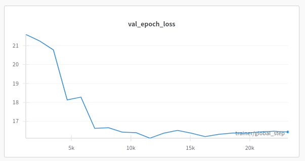

# Technical Report
## Challange: multi-view foul recognition
### Team Members: Miłosz Łopatto, Adam Górski

## Implementation
We have started with the SDK provided to multi-view foul recognition challange. First we have started with fixing some errors
from the provided code, cleaning it up and wrapping it up with Pytorch Lightning which allowed to us easily track experiments
using custom logger for Weights and Biases.

## Data processing
We have started experimenting with the number of frames per second, start frame and the end frame.
Generally we found keeping the middle of the extracted clip in 75th frame to be the most efficient. We have also tried testing with a higher amount of frames per second (24fps) but id did not provide us any better results. We have also set up starting frame at 58 and ending frame at 92. We have been also experimenting with data augmentation such as Gaussian Blur. We have also managed to improve results of augmentation by removing from original implementation random erasing but keeping all of the other transforms. It is also worth adding that we managed to obtain the best results by setting the number of views as 5 - with any other number the model struggled to learn.

## Model architecture
Despite running on a large cluster with slurm we did not manage to make swin3d transformer as we have been experiencing out of memory issues. Because of that we used mvitv2 which had close to the same results as swin3d. We have also managed to slightly improve our results by using weighted loss function. Also the only aggregation that managed to lead to improved results was attention. Using both average and max led to significantly lower results.
We have also been experimenting with ViViT (A Video Vision Transformer) with custom classification head
but did not manage to obtain any results better than the baseline.

## Training
We have been using pytorch learning trainer object to make training managmement much easier. For training we have split the training dataset into training and validation to prevent overfitting
with proportions 7:3. We have been testing also multiple callbacks such as model saving per step
and early stopping. We have also been using disributed data parallel strategy for training.

## Hyperparametrs for the best training job

```json
"start_frame": 58,
"end_frame": 92,
"fps": 12,
"num_views": 5,
"pre_model": "mvit_v2_s",
"max_num_worker": 4,
"batch_size": 2,
"data_aug": true,
"pooling_type": "attention",
"weight_decay": 0.001,
"step_size": 3,
"gamma": 0.35,
"LR": 5.0e-05,
"weighted_loss": true

```

## Loss function for the best training job 

